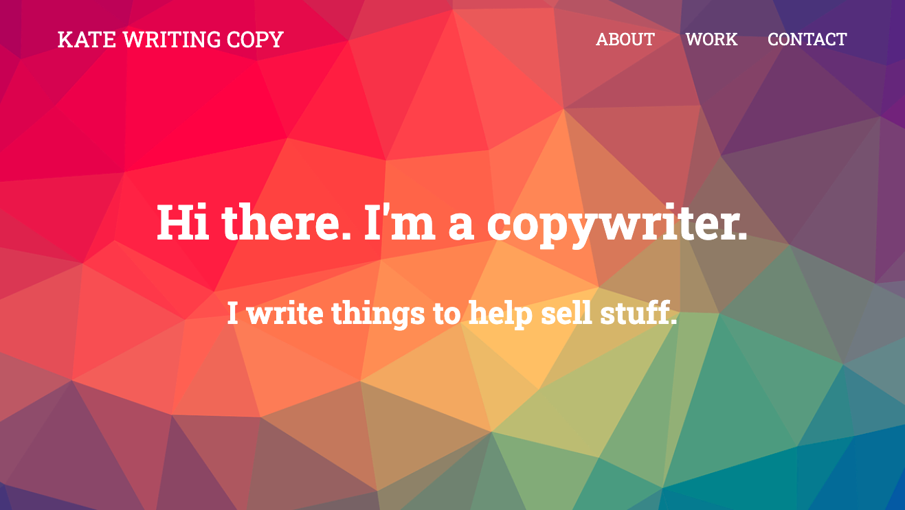
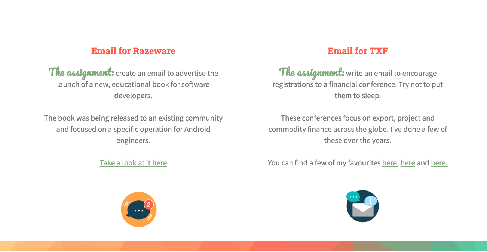

# Portfolio Website

Back when I used to write things for money I made my own website to display a fraction of my portfolio.

The current iteration of this website is being updated here @ https://www.katewriting.co.uk

### Have a look

To see the original in it's full glory:

You can clone this repo and open up the html file in your browser or visit the deployed version, by visiting environments and 'view deployment'.

## Preview

## Challenge

To create a website that could host a variety of files and easily navigate between different sections including:

* About
* Work
* Contact Information

## Approach

This website was built when I was first learning HTML, CSS and JS. It follows a single page design with 3 sections which are accessed by the relative hyperlinks in the top right.

It was the the first opportunity I had to experiment with background images, different sections and deployment.

## Technology Used

• HTML • CSS • GitHub Pages • SiteGround (for hosting)

## Future Additions

* To manage routing with a backend framework
* Add pages for individual portfolio pieces
* Employ Bootstrap to improve the design
